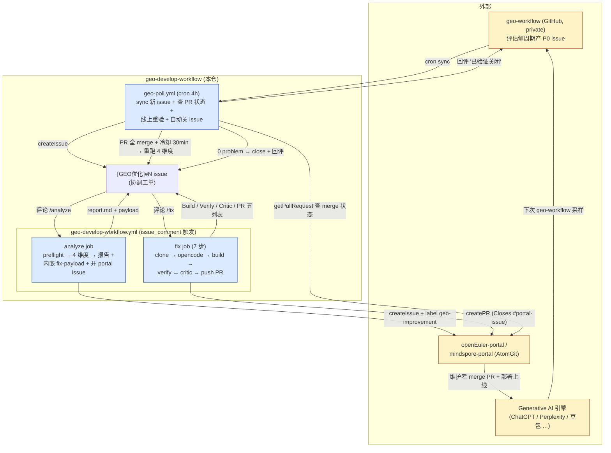

# GEO Develop Workflow

GEO(Generative Engine Optimization)优化开发工作流的**协调仓**。在 GitHub Actions 上跑全闭环:`geo-workflow 评估侧产 P0 issue → 本仓 [GEO优化] 跟踪 → 4 维度分析 → 跨仓提 portal issue / PR → 本地 build + verify + critic 三重护栏 → 线上重验 → 自动关闭`。

## 目录

- [整体流程](#整体流程)
- [三个触发器](#三个触发器)
- [4 维度分析(只看官网域)](#4-维度分析只看官网域)
- [/analyze 流水线](#analyze-流水线)
- [/fix 流水线(8 步,带 2 道硬护栏 + 2 个 best-effort build)](#fix-流水线8-步带-2-道硬护栏--2-个-best-effort-build)
- [闭环(geo-poll cron)](#闭环geo-poll-cron)
- [对外可见物 body 规范](#对外可见物-body-规范)
- [用法](#用法)
- [本地调试](#本地调试)
- [仓库结构](#仓库结构)
- [配置](#配置repo-secrets--variables)
- [范围与限制](#范围与限制)
- [架构决策](#架构决策)

## 整体流程



## 三个触发器

| 触发 | 文件 | 时机 | 干什么 |
| --- | --- | --- | --- |
| 评论 `/analyze` | `geo-develop-workflow.yml#analyze` | 用户在 `[GEO优化]` issue 下评论 | preflight + 4 维度分析 + 报告评论 + portal 仓建 issue |
| 评论 `/fix` | `geo-develop-workflow.yml#fix` | 同上(读最近一次 /analyze 评论的 payload,不需重 /analyze) | 7 步流水线:clone → opencode → portal build → verify → critic → push PR |
| 定时 cron | `geo-poll.yml` | 每 4 小时(调试期改 weekly),`workflow_dispatch` 可手工 | ① 同步 geo-workflow 新 P0 ② 查已有 PR 状态 ③ 全 merge → 线上重验 → 0 problem 自动关 |

## 4 维度分析(只看官网域)

| 维度 | 检查 | 实现 |
| --- | --- | --- |
| 静态化(SSG/SSR) | HTTP 抓 vs Browser 抓,内容差异判 SPA | `scripts/checks/static-render.js` |
| Schema(JSON-LD) | 解析 `<script type=application/ld+json>` + 字段 | `scripts/checks/schema.js` |
| TDK | `<title>` 10-60 字符 / `<meta description>` 50-160 字符 + 重复检测 | `scripts/checks/tdk.js` |
| Sitemap 包含性 | 拉 sitemap.xml(支持 sitemapindex 递归 + host 归一) | `scripts/checks/sitemap-inclusion.js` |

非官网域(`forum.openeuler.org` / `discuss.*` / `news.*` 等)自动 `scope_skipped`,不进 fix payload。
openEuler 双域名 `www.openeuler.org` ↔ `www.openeuler.openatom.cn` 在 sitemap 对比时自动归一(同份代码 + 不同构建环境变量)。

**没有 severity 分级** — analyzer 出的都是确定性判定,只要标了就需要改。

## /analyze 流水线

```text
fetch-geo-issues       从 geo-workflow 拉 P0 候选(URL 字段 fallback,防死链)
       ↓
run-analysis           对每个 URL:
                        - preflight (status 200 / body 非空 / 非"跳根") - 失败 → url_unreachable,不进 fix 范围
                        - 4 维度判定
       ↓
open-portal-issues     先于 generate-report 跑 — 才能把 portal_issue_url 嵌进 payload
       ↓
generate-report        Markdown 报告 + 末尾 geo-analysis-payload v1 JSON 折叠块
                        → POST 为 issue 评论(/fix 的唯一信号源)
```

**特殊情况**:上游 0 候选(geo-workflow issue 不存在 / 关联 question 全无 `official_urls`)走"跳过"语义,正常出报告但不开 portal issue,不当 workflow 失败。

## /fix 流水线(8 步,带 2 道硬护栏 + 2 个 best-effort build)

```text
[1/8] clonePortal              持久 cache (~/.cache/geo-bot/portals/),refresh 失败 fallback fresh clone
[2/8] portal baseline build    pnpm install + pnpm build 一次,best-effort:
                                跑通 → 拿到 dist,后续 verify 可对 build 产物真验 schema/static-render
                                跑不通 → warn + 跳过 post-agent build,verify 退到源码层(schema/static-render → deferred)
[3/8] write fix-context.json   按 URL 聚合 problems,output.md 落 runner 临时区(不入 PR)
[4/8] runOpencode              opencode + glm-5,white-list 4 类配置 (schema/tdk/sitemap/prerender)
                                必带 --dangerously-skip-permissions
                                prompt 可选(非强制)让 agent 跑 build 自验,build 跟环境关联太深,不强求
[5/8] portal build (post-agent) best-effort,同 baseline。挂了只 warn 不阻 push,reviewer 看 PR body / critic 自行判
[6/8] pre-push verify  ⛳ 护栏1  sitemap.xml + tdk frontmatter 直接源码验
                                schema/static-render:有 build dist 就真验,没有就 deferred 等 geo-poll 线上重验
                                still_failing → status=verify_failed, 不 push
[7/8] critic  ⛳ 护栏2           第二次 opencode (skeptic 角色),输入: problems + agent_output + verify_checks + git diff
                                critic verdict=block → status=critic_blocked, 不 push
                                pass/warn 都允许 push,critic 输出贴到 PR body
[8/8] pushAndPr                 createPR (Closes #portal-issue 自动关) + 评论结果到 trigger issue
                                listPullRequests 漏判时,createPR 抛 PullRequestAlreadyExistsError 自动 fallback update
```

**两道硬护栏**:`verify_failed`(verify 维度仍未修)+ `critic_blocked`(critic 红线 block)。Build 失败仅 warning,reviewer 决策。

**退路**:`GEO_BUILD_DISABLE=1` 关 baseline + post-agent build(schema/static-render 直接 deferred);`CRITIC_DISABLE=1` 关 critic。

## 闭环(geo-poll cron)

| 阶段 | 脚本 | 行为 |
| --- | --- | --- |
| sync 新 issue | `sync-geo-issues.js` | 拉 geo-workflow `state=open + label=geo-improvement` → 本仓 createIssue;已存在但 body 是老格式(无 `<!-- geo-sync-body v2 -->` marker)的自动 PATCH 刷格式 |
| 查 PR + 重验 | `poll-portal-status.js` | 扫本仓 open `[GEO优化]` issue → 解析评论里的 atomgit PR URL(支持 `atomgit.com / gitcode.com` 双域名 + `pull / pulls / merge_requests` 三个路径别名) → 查 `getPullRequest` 状态 → 全 merge + 距最新 merge 30min 冷却 → analyzer 跑线上重验 → 0 problem 则 close + 回评 |

**幂等性**:评论里的 `<!-- geo-revalidated v1 ... -->` / `<!-- geo-pr-status v1 ... -->` marker 防 cron 重复刷。

**preflight_failed 的 URL 不阻断关闭** — URL 失效是评估侧上游数据问题,本仓修不了。

## 对外可见物 body 规范

portal 仓的 PR 和 portal issue 是面向 portal 维护人的外部工件,body 格式有专门约束:

- **关联行**:`**关联**: [geo-workflow #N](url) · [portal issue #M](url)` — 不外露 geo-develop 内部协调 issue
- **问题清单**:三列表 `Dimension / URL / Description`(无 severity 分级)
- **Pre-push 自检表**(PR body 独有):五列 `状态 / Dimension / URL / Before / After`,after 自解释(`已嵌入 JSON-LD (WebPage)` / `需 portal build 后验证` / `agent 跳过未改` 等)
- **Critic 块**(PR body 独有):`<details open>` 默认展开
- **Closes #N**:PR body 末尾追加,atomgit 合并自动关 portal issue
- portal issue 用 `[GEO] {community} #{N}: {title}` 标题前缀去重
- 不外露:runner 临时路径、trigger issue 链接、agent 内部状态

## 用法

### 第一次:开 tracker issue

- 手工开 `[GEO优化]#42`(`#N` 指 geo-workflow 的 issue 编号),或者
- 等 `geo-poll` cron 自动 sync

### 在 issue 下评论

```text
/analyze         # 跑分析,产出报告评论 + portal issue
/fix             # 基于最近一次 /analyze 评论的 payload,7 步流水线修 + 提 PR
```

`/analyze` 没明确 target 时(标题只是 `[GEO优化]` 不带 `#N`),扫 geo-workflow 全部 open P0。

### portal PR merge 之后

`geo-poll` cron(4h 一次 / `workflow_dispatch` 立即触发):

1. 查所有 open `[GEO优化]` issue 评论里的 atomgit PR URL 状态
2. 全 merge + 距最新 merge 30min 冷却 → 重跑 4 维度(对线上 URL)
3. 0 problem → close 本仓 issue + 评论 `✅ 已验证关闭` + 回评 geo-workflow 原 issue
4. 仍有问题 → 评论详情(带具体 URL × dimension),本仓 issue 保持 open,可手工再 `/fix`

## 本地调试

```bash
pnpm install
export GITHUB_TOKEN=$(grep '^GITHUB_TOKEN' .env | sed 's/.*=[[:space:]]*//')
export ATOMGIT_TOKEN=$(grep '^ATOMGIT_TOKEN' .env | sed 's/.*=[[:space:]]*//')

# 单个 issue:拉候选 → 分析 → 报告
pnpm run fetch-issues  -- --issue=21 --communities=openEuler --output=/tmp/c.json
pnpm run run-analysis  -- --input=/tmp/c.json --output=/tmp/a.json --skip-browser
pnpm run report        -- --input=/tmp/a.json --output=/tmp/report.md

# 单 URL 直跑
pnpm run analyze -- https://www.openeuler.org/zh/ --skip-browser

# /fix 本地复现(SSH 到 runner 后):
cd ~/.cache/geo-bot/portals/openeuler-openEuler-portal
cat <runner-tmp>/opencode-prompt-fix-openEuler-21.txt | opencode run - \
  --model alibaba-cn/glm-5 --agent build --dangerously-skip-permissions
```

## 仓库结构

```text
scripts/
  lib/
    html-fetch.js              HTTP + playwright Browser 双模式抓取
    atomgit-api.js             AtomGit REST 客户端(retry + PullRequestAlreadyExistsError 自动 fallback)
    community-map.js           community → portal 仓 + 官网 host(含 canonicalizeUrlHost)
    portal-build.js            pm + build script 自动检测,跑 install + build,返回 output_dir
  checks/
    static-render.js           SPA 判定
    schema.js                  JSON-LD 解析 + @type 校验
    tdk.js                     title / description 长度 + duplicate
    sitemap-inclusion.js       sitemapindex 递归 + canonical host 归一
    post-fix-verify.js         agent 改完 pre-push 自检 + build 产物真验

  analyze-discoverability.js   单 URL → 4 维度 JSON (含 URL preflight)
  run-analysis.js              批量 URL,过滤非官网域
  generate-report.js           analysis + portal-issues → Markdown 报告 + payload v1

  fetch-geo-issues.js          从 geo-workflow 拉 P0 候选 (URL fallback)
  fetch-fix-payload.js         扫 trigger issue 评论取 payload v1
  open-portal-issues.js        atomgit 建 / 更新 portal 跟踪 issue (findIssueByTitlePrefix 去重)
  execute-fix-runs.js          7 步流水线主入口 (clone/opencode/build/verify/critic/PR)
  comment-fix-summary.js       修复结果回评(Build / Verify / Critic / PR 五列表)

  sync-geo-issues.js           geo-poll: geo-workflow 新 P0 → 本仓 tracker (BODY_MARKER 旧格式 patch)
  poll-portal-status.js        geo-poll: 查 PR + 线上重验 + 自动关 issue

.github/
  workflows/
    geo-develop-workflow.yml   analyze + fix 两个 job (issue_comment 触发)
    geo-poll.yml               cron 4h + workflow_dispatch (sync + poll 两步)
  agents/
    geo-fix-prompt.md          fix agent prompt (white-list 4 类配置)
    geo-critic-prompt.md       critic agent prompt (ground truth = verify_checks)
  actions/                     composite actions (历史保留;实际 issue/PR 走 atomgit-api.js 直调)

docs/
  decisions.md                 架构决策记录(ADR)
  sessions/                    每日会话日志(可选)
  progress.md                  社区进度(可选)
  analytics.md                 GEO 原则(可选)
```

## 配置(repo secrets / variables)

| 名称 | 类型 | 必填 | 用途 |
| --- | --- | --- | --- |
| `GITHUB_TOKEN` | 内置 secret | - | 当前 repo 评论/push,GH Actions 自动注入 |
| `GEO_GITHUB_TOKEN` | repo secret | ✅ | PAT,读 geo-workflow(private)+ 跨仓回评 |
| `ATOMGIT_TOKEN` | repo secret | ✅ | atomgit createIssue/PR/push |
| `ATOMGIT_API_BASE` | env(可选) | - | 默认 `https://api.atomgit.com` |
| `AI_MODEL` | repo variable | - | opencode 模型 id,默认 `alibaba-cn/glm-5` |
| `AI_AGENT` | repo variable | - | opencode agent,默认 `build` |
| `AI_EXTRA_ARGS` | repo variable | - | 默认 `--dangerously-skip-permissions`(CI 必需) |
| `OPENCODE_TIMEOUT_MS` | env(可选) | - | opencode 单次超时,默认 25min |
| `GEO_SKIP_BROWSER` | repo variable | - | 设 `true` 跳过 playwright(加速分析) |
| `GEO_PORTAL_CACHE_DIR` | env(可选) | - | portal cache 根,默认 `~/.cache/geo-bot/portals` |
| `GEO_BUILD_DISABLE` | env(可选) | - | 设 `1` 跳过 `[2/8]` baseline + `[5/8]` post-agent build(schema/static-render 回落 deferred) |
| `CRITIC_DISABLE` | env(可选) | - | 设 `1` 跳过 `[6/7] critic`(本地调试) |
| `CRITIC_AGENT_FILE` | env(workflow 注入) | - | critic prompt 路径,默认 `.github/agents/geo-critic-prompt.md` |
| `GEO_WORKFLOW_REPO` | env(可选) | - | 上游评估仓 slug,默认 `opensourceways/geo-workflow` |

## 范围与限制

- 覆盖社区:**openEuler + MindSpore**(新加在 `scripts/lib/community-map.js` 加条目)
- 仅 P0 类 issue(`official_urls` 非空),P1 内容空白类跳过
- 运行在 `portal-x86` self-hosted runner(opencode + glm-5 已配置)
- 仅看官网域,`forum / discuss / news` 子站不在 fix 范围
- agent 改动严格限于 4 类:`schema` JSON-LD 配置、`tdk` frontmatter / meta、`sitemap.xml` 生成器、`vite/vitepress/nuxt.config.*` 里的 `prerender` 段

## 架构决策

完整 ADR(决策、备选、理由、后果)见 [docs/decisions.md](docs/decisions.md)。本仓所有架构选择 / 流程变更都按 ADR 形式追溯,README 只描述**当前状态**,不解释"为什么"。
