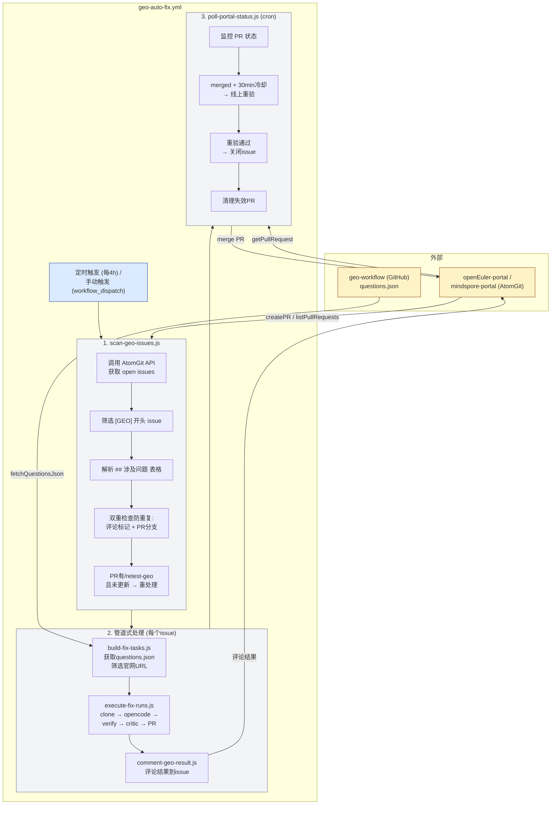

# GEO Auto Fix Workflow

GEO(Generative Engine Optimization)自动修复工作流，用于扫描 AtomGit portal 仓库的 `[GEO]` issue，自动执行 SEO/GEO 可发现性修复。

## 概述

本仓库提供自动化 workflow，实现：
- 定时扫描 AtomGit portal 仓库的 `[GEO]` 开头 issue
- 自动获取问题定义（questions.json）
- 调用 opencode agent 执行修复
- pre-push verify + critic 双重护栏
- 创建 PR 并评论结果

## 流程图



## 快速开始

### 本地调试

```bash
# 安装依赖
pnpm install

# 设置环境变量
export ATOMGIT_TOKEN=xxx
export GEO_GITHUB_TOKEN=xxx

# 扫描 issues
node scripts/scan-geo-issues.js --owner=openeuler --repo=openEuler-portal > issues.json

# 处理单个 issue
cat issues.json | jq -c '.issues[0]' > issue.json
cat issue.json | node scripts/build-fix-tasks.js | node scripts/execute-fix-runs.js | tee result.json | node scripts/comment-geo-result.js --owner=openeuler --repo=openEuler-portal

# Dry-run 测试
node scripts/scan-geo-issues.js --owner=openeuler --repo=openEuler-portal --dry_run=true
```

### Workflow 手动触发

1. 进入 GitHub Actions 页面
2. 选择 `GEO Auto Fix` workflow
3. 点击 `Run workflow`
4. 填写参数:
   - owner: `openeuler`
   - repo: `openEuler-portal`
   - community: `openEuler` (可选)
   - dry_run: `true` (仅扫描测试)

## 核心脚本

| 脚本 | 用途 |
|------|------|
| `scan-geo-issues.js` | 扫描 AtomGit portal 仓库的 `[GEO]` issue |
| `build-fix-tasks.js` | 根据问题ID获取questions.json数据，构建修复任务 |
| `execute-fix-runs.js` | 执行 opencode agent 修复，创建 PR |
| `comment-geo-result.js` | 将修复结果评论到 AtomGit issue |
| `poll-portal-status.js` | 监控 PR 状态，重验并关闭已解决的 issue |

## 修复维度

| 维度 | 检查 | 实现 |
|------|------|------|
| 静态化(SSG/SSR) | HTTP 抓 vs Browser 抓,内容差异判 SPA | `scripts/checks/static-render.js` |
| Schema(JSON-LD) | 解析 `<script type=application/ld+json>` + 字段 | `scripts/checks/schema.js` |
| TDK | `<title>` 10-60 字符 / `<meta description>` 50-160 字符 | `scripts/checks/tdk.js` |
| Sitemap 包含性 | 拉 sitemap.xml(支持 sitemapindex 递归) | `scripts/checks/sitemap-inclusion.js` |

## 防重复处理机制

### 双重检查

1. **评论标记检查**: 检查 issue 评论是否已有 `<!-- geo-processed v1 -->` 标记
2. **PR分支检查**: 检查 portal 仓库是否已有 `geo/fix-{community}-{issue_number}` 分支的 open PR
   - 若 PR 存在，进一步检查 PR 评论是否包含 `/retest-geo`
   - 有 `/retest-geo` 且 PR 未更新 → 继续处理（重新修复）
   - 无 `/retest-geo` 或 PR 已更新 → 跳过

### 跳过逻辑

- 无问题ID → 跳过
- 已有处理标记评论 → 跳过
- PR存在且无 `/retest-geo` 评论 → 跳过
- PR存在且有 `/retest-geo` 评论，但 PR 已更新 → 跳过
- 所有问题都不涉及官网域 → 跳过
- URL preflight 失败 → 跳过该 URL
- URL 分析无问题 → 跳过该 URL

## Issue 格式要求

### 标题

必须以 `[GEO]` 开头。

示例: `[GEO] openEuler Compass-CI 持续集成平台页面SEO优化`

### Body 表格

必须包含 `## 涉及问题` 表格:

```markdown
## 涉及问题
| 问题ID | 问题 | 引用率 | 已引用平台 |
| --- | --- | --- | --- |
| q_074 | openEuler Compass-CI... | 15% | ChatGPT, Perplexity |
| q_123 | ... | 8% | Gemini |
```

第一列 `问题ID` (q_xxx 格式) 用于匹配 questions.json 数据。

## Community 配置

定义在 `scripts/lib/community-map.js`:

| Community | Portal仓库 | 官网域 |
|-----------|------------|--------|
| openEuler | openeuler/openEuler-portal | www.openeuler.org, www.openeuler.openatom.cn |
| MindSpore | mindspore/mindspore-portal | www.mindspore.cn |

## 配置 (repo secrets / variables)

| 名称 | 类型 | 必填 | 用途 |
|------|------|------|------|
| `ATOMGIT_TOKEN` | repo secret | ✅ | AtomGit API 认证 |
| `GEO_GITHUB_TOKEN` | repo secret | ✅ | GitHub geo-workflow 仓库访问 (获取 questions.json) |
| `AI_MODEL` | repo variable | - | opencode 模型 id，默认 `alibaba-cn/glm-5` |
| `AI_AGENT` | repo variable | - | opencode agent，默认 `build` |
| `OPENCODE_TIMEOUT_MS` | env | - | opencode 单次超时，默认 25min |
| `GEO_BUILD_DISABLE` | env | - | 设 `1` 跳过 baseline + post-agent build |
| `CRITIC_DISABLE` | env | - | 设 `1` 跳过 critic |

## 仓库结构

```text
scripts/
  lib/
    atomgit-api.js             AtomGit REST 客户端 (retry + 所有 API)
    community-map.js           community → portal 仓 + 官网 host
    geo-workflow-data.js       questions.json 获取
    portal-build.js            portal 构建
    utils.js                   公共工具函数
    geo-markers.js             标记常量

  checks/
    static-render.js           SPA 判定
    schema.js                  JSON-LD 解析
    tdk.js                     title / description 检查
    sitemap-inclusion.js       sitemap 收录检查
    post-fix-verify.js         pre-push 自检

  scan-geo-issues.js           扫描 [GEO] issues
  build-fix-tasks.js           构建修复任务
  execute-fix-runs.js          执行修复流程
  comment-geo-result.js        评论修复结果
  poll-portal-status.js        PR 状态监控 + 重验

.github/
  workflows/
    geo-auto-fix.yml           主 workflow
  agents/
    geo-fix-prompt.md          fix agent prompt
    geo-critic-prompt.md       critic agent prompt

docs/
  decision.md                 架构决策与流程文档
```

## 详细文档

完整流程说明、脚本接口、配置参数见: [docs/decision.md](docs/decision.md)