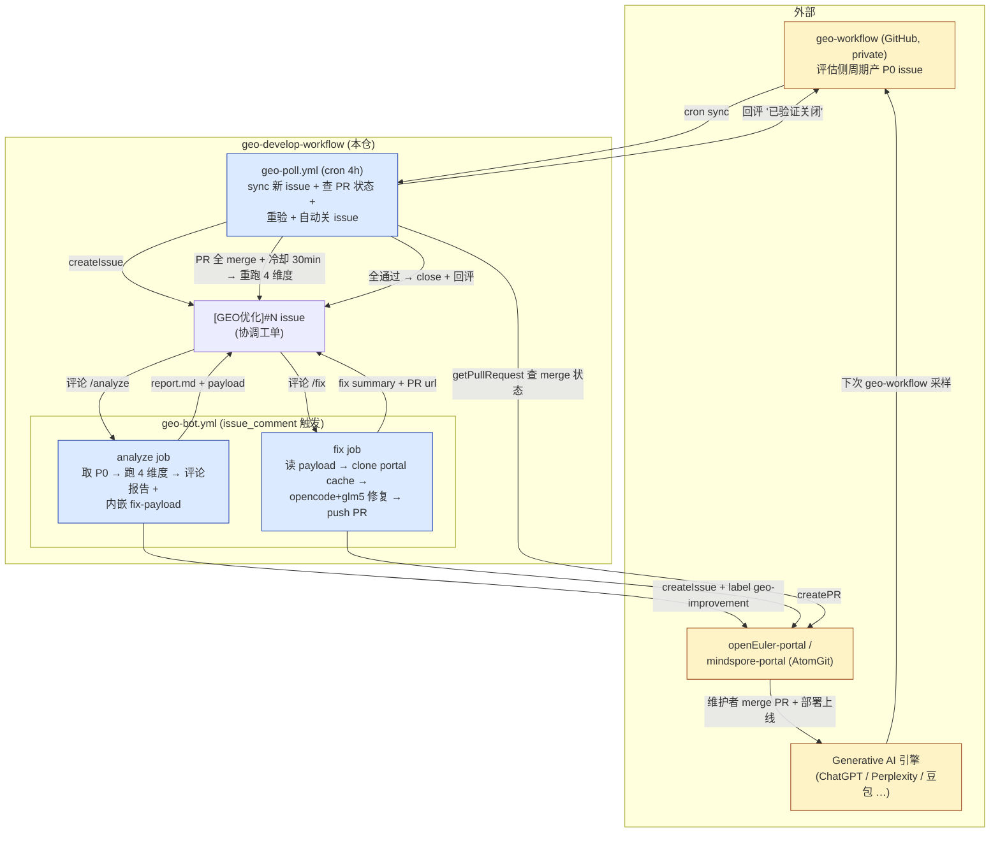

# geo-develop

GEO 优化开发工作流的**协调仓**,在 GitHub Actions 上跑全闭环:`geo-workflow 评估侧产 P0 issue → 本仓 [GEO优化] 跟踪 → 4 维度分析 → 跨仓提 portal issue/PR → 线上重验 → 自动关闭`。

## 整体流程



## 三个触发器

| 触发 | 文件 | 时机 | 干什么 |
| --- | --- | --- | --- |
| 评论 `/analyze` | `geo-bot.yml#analyze` | 用户在 `[GEO优化]` issue 下评论 | 4 维度分析 + 报告评论 + portal 仓开 issue |
| 评论 `/fix` | `geo-bot.yml#fix` | 同上(读最近一次 /analyze 评论的 payload,不需重 /analyze) | opencode+glm5 改 portal 仓 + 提 PR + 回评 |
| 定时 cron | `geo-poll.yml` | 每 4 小时(调试期改 weekly),`workflow_dispatch` 可手工 | ① 同步 geo-workflow 新 P0 ② 查已有 PR 状态 ③ 全 merge → 重验 → 自动关 |

## 4 维度分析(只看官网域)

| 维度 | 检查 | 实现 |
| --- | --- | --- |
| 静态化(SSG/SSR) | HTTP 抓 vs Browser 抓,内容差异判 SPA | `scripts/checks/static-render.js` |
| Schema(JSON-LD) | 解析 `<script type=application/ld+json>`、类型/字段是否合理 | `scripts/checks/schema.js` |
| TDK | Title 10-60 / Description 50-160 / Keywords 缺失 | `scripts/checks/tdk.js` |
| Sitemap 包含性 | 拉 sitemap.xml(支持 sitemapindex 递归),URL 是否被收录 | `scripts/checks/sitemap-inclusion.js` |

非官网域(forum、discuss 等)自动 `scope_skipped`,不进 fix 范围。

## 用法

### 第一次:开 tracker issue

要么手工开 `[GEO优化]#42`(`#N` 指 geo-workflow 的 issue 编号),要么等 `geo-poll` cron 自动 sync。

### 在 issue 下评论

```text
/analyze         # 跑分析,产出报告评论 + portal issue
/fix             # 基于最近一次 /analyze 评论的 payload 修代码 + 提 PR
```

`/analyze` 没明确 target 时(标题只是 `[GEO优化]` 不带 `#N`),会扫 geo-workflow 全部 P0。

### portal PR merge 后

等 `geo-poll` cron 跑(每 4 小时 / `workflow_dispatch` 立即),它会:

1. 查所有 open `[GEO优化]` issue 评论里的 atomgit PR URL 状态
2. 全 merge + 距最新 merge 30min 冷却 → 重跑 4 维度
3. critical/important 全清零 → close 本仓 issue + 评论 "✅ 已验证关闭" + 回评 geo-workflow 原 issue
4. 仍有问题 → 评论详情,本仓 issue 保持 open(可手工再 `/fix`)

## 本地调试

```bash
pnpm install
export GITHUB_TOKEN=$(grep '^GITHUB_TOKEN' .env | sed 's/.*=[[:space:]]*//')

# 单个 issue:拉候选 → 分析 → 报告
pnpm run fetch-issues  -- --issue=21 --communities=openEuler --output=/tmp/c.json
pnpm run run-analysis  -- --input=/tmp/c.json --output=/tmp/a.json --skip-browser
pnpm run report        -- --input=/tmp/a.json --output=/tmp/report.md

# 单 URL 直跑
pnpm run analyze -- https://www.openeuler.org/zh/ --skip-browser
```

## 仓库结构

```text
scripts/
  lib/{html-fetch,atomgit-api,community-map}.js   共用工具
  checks/{static-render,schema,tdk,sitemap-inclusion}.js   单维度判定
  analyze-discoverability.js   单 URL → 4 维度 JSON
  run-analysis.js              批量 URL,过滤非官网域
  generate-report.js           analysis → Markdown(末尾内嵌 fix-payload)
  fetch-geo-issues.js          从 geo-workflow 拉 P0 候选
  fetch-fix-payload.js         从 issue 评论抽 fix-payload
  open-portal-issues.js        atomgit createIssue/updateIssue(去重)
  execute-fix-runs.js          clone portal cache → opencode → push PR
  comment-fix-summary.js       回评 PR 链接 + agent 修改清单到本仓 issue
  sync-geo-issues.js           geo-poll: geo-workflow 新 P0 → 本仓 tracker
  poll-portal-status.js        geo-poll: 查 PR + 重验 + 自动关 issue

.github/
  workflows/geo-bot.yml        analyze + fix 两个 job(issue_comment 触发)
  workflows/geo-poll.yml       cron + workflow_dispatch
  actions/atomgit-create-{issue,pr}/   AtomGit API composite action
  actions/run-agent/                    opencode 调用器(沿用,实际由 execute-fix-runs 直接 spawn)
  agents/geo-fix-prompt.md             修复 prompt(白名单约束)

docs/
  design.md       完整架构(看第十节)
  decisions.md    ADR-0001 ~ ADR-0017
  sessions/       每日会话日志
  progress.md     社区进度
  analytics.md    GEO 原则
```

## 配置(repo secrets / variables)

| 名称 | 类型 | 必填 | 用途 |
| --- | --- | --- | --- |
| `GITHUB_TOKEN` | 内置 secret | - | 当前 repo 评论/push,GH Actions 自动注入 |
| `GEO_GITHUB_TOKEN` | repo secret | ✅ | PAT,读 geo-workflow(private)+ 跨仓回评 |
| `ATOMGIT_TOKEN` | repo secret | ✅ | atomgit createIssue/PR/push |
| `ATOMGIT_API_BASE` | env(可选) | - | 默认 `https://api.atomgit.com` |
| `AI_MODEL` | repo variable | - | opencode 模型 id,默认 `alibaba-cn/glm-5` |
| `AI_AGENT` | repo variable | - | opencode agent,默认 `build` |
| `AI_EXTRA_ARGS` | repo variable | - | 默认 `--dangerously-skip-permissions`(CI 必需) |
| `OPENCODE_TIMEOUT_MS` | env(可选) | - | opencode 单次超时,默认 25min |
| `GEO_SKIP_BROWSER` | repo variable | - | 设 `true` 跳过 playwright 抓取(加速分析) |
| `GEO_PORTAL_CACHE_DIR` | env(可选) | - | portal cache 根,默认 `~/.cache/geo-bot/portals` |

## 关键决策(详见 [docs/decisions.md](docs/decisions.md))

- 协调仓为 geo-develop,issue+评论触发(ADR-0001)
- 仅 4 维度(static/schema/tdk/sitemap),robots.txt + llms.txt 暂不做(ADR-0003)
- /analyze 自动开 portal issue(ADR-0004)
- /fix 用 opencode+glm5(ADR-0005)
- AtomGit API 路径 `/api/v5/`,Issue 接口 owner-scoped + body 字段填 `repo`(ADR-0013)
- /fix 信号源走 issue 评论里的 `geo-analysis-payload v1` JSON,不依赖文件系统(ADR-0012)
- portal 仓持久 cache,失败 fallback fresh clone(ADR-0011)
- opencode 必须带 `--dangerously-skip-permissions`,否则 CI 无 TTY 永久 hang(ADR-0016)
- geo-runs 不入仓,审计走 issue 评论(ADR-0015)
- 闭环 cron:sync + 重验 + 自动关 issue(ADR-0017)

## 范围与限制

- 覆盖社区:openEuler + MindSpore(新加在 `scripts/lib/community-map.js` 加条目)
- 仅 P0 类 issue(`official_urls` 非空),P1 内容空白类跳过
- 运行在 portal-x86 self-hosted runner(opencode + glm5 已配置)
- 仅看官网域,forum/discuss/news 子站不在 fix 范围
