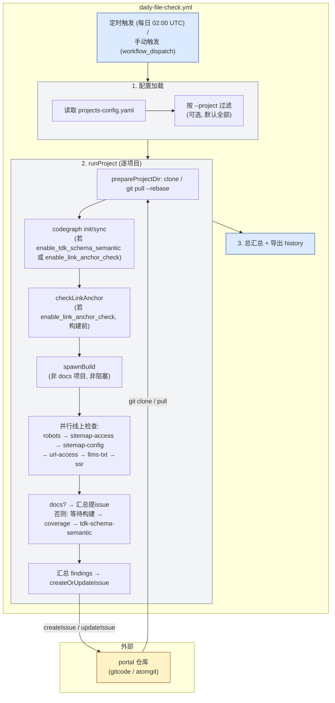

# Daily File Check Workflow

## 概述

Daily File Check 是一个**配置驱动**的定时巡检流程，用于检查前端 portal 项目页面的 SEO/GEO 配置完整性。逐项目 clone → 构建 → 运行可插拔检查项 → 按维度/模块汇总 findings → 提 issue 到对应仓库。

所有待检项目集中维护在仓库根的 [`projects-config.yaml`](../projects-config.yaml)（与 geo-issue-analyze 共享同一配置文件）。脚本逐项目运行，把检查发现的问题汇总成 issue 提到对应仓库。

> gitcode.com 与 atomgit.com 是同一平台的两个域名，API（`api.atomgit.com`）与鉴权（`ATOMGIT_TOKEN`）通用。

## 流程图



## 配置文件 projects-config.yaml

与 geo-issue-analyze 共享。每个项目一个条目，字段如下：

| 字段 | 必填 | 说明 |
|------|------|------|
| `name` | ✅ | 项目名，`--project` 按此精确匹配 |
| `owner` / `repo` | ✅ | 仓库 owner/repo，用于缓存目录与提 issue |
| `repo_url` | 构建类检查必填 | clone 地址；私有仓库会注入 `ATOMGIT_TOKEN` |
| `project_type` | 可选 | `portal`（默认，需构建）/ `docs-website`（跳过构建，部分检查）/ `docs`（纯文档存档，`skip_check: ['all']`） |
| `branch` | 可选 | 目标分支（当前用 `git pull --rebase` 跟随默认分支） |
| `framework` | 可选 | 框架标识（VitePress / Nuxt），SSR 检测按此判断 |
| `build_cmd` | portal 类型必填 | 构建用的 npm script（如 `build:geo` / `generate:geo`） |
| `build_dir` | portal 类型必填 | 构建产物目录（相对仓库根，如 `app/.vitepress/dist`） |
| `seo_config_dir.tdk` | 可选 | TDK 配置根目录（如 `.geo/tdks`），仅用于 issue 正文参考提示（不再作为 sitemap-tdk 检查依据） |
| `seo_config_dir.schema` | 可选 | JSON-LD 配置根目录（如 `.geo/jsonld`），仅用于 issue 正文参考提示（不再作为 sitemap-schema 检查依据） |
| `accessible_routes` | sitemap-coverage 必填 | 页面路由 glob 数组（如 `/zh/**/*`），用于比对构建产物收录 |
| `skip_check` | 可选 | 跳过的检查项数组，支持 `['all']` 跳过整个项目 |
| `ignore_routes` | 可选 | 跳过检查的页面路由正则数组（如 `/(zh\|en)/(blog\|news)`） |
| `home` | 可选 | 线上站点 URL 数组，供 robots/sitemap/llms-txt/ssr 检查使用 |
| `home_pages` | sitemap-tdk 必填 | 各语言首页 URL 列表（`[{lang, url}]`），作为 sitemap-tdk 检查的 TDK 比对基线；按路径段匹配 `lang`（覆盖 `/zh/foo` 前缀与 `/foo/en` 后缀两种结构）+ origin 作用域 + 根路径(`/`)catch-all |
| `enable_tdk_schema_semantic` | 可选 | 启用 TDK/Schema 语义检查（含 render-change 分析），默认 `false` |
| `semantic_analysis_commits_count` | 可选 | 语义检查分析最近 N 个 commits，默认 `5` |
| `enable_link_anchor_check` | 可选 | 启用 link-anchor 检查，默认 `false`；检测 JS 跳转而非 `<a href>` 的导航链接 |

示例（摘自实际配置）：

```yaml
projects:
  # portal 类型 - 需要构建，启用全部高成本检查
  - name: openEuler
    owner: openeuler
    repo: openEuler-portal
    project_type: portal
    repo_url: https://gitcode.com/openeuler/openEuler-portal.git
    branch: master
    framework: VitePress
    build_dir: app/.vitepress/dist
    build_cmd: build:geo
    enable_link_anchor_check: true
    enable_tdk_schema_semantic: true
    semantic_analysis_commits_count: 10
    accessible_routes:
      - /zh/**/*
      - /en/**/*
    ignore_routes:
      - /(zh|en)/(other/)?(blog|news)
    seo_config_dir:
      tdk: .geo/tdks
      schema: .geo/jsonld
    home:
      - https://www.openeuler.org/
    home_pages:
      - lang: zh
        url: https://www.openeuler.org/zh/
      - lang: en
        url: https://www.openeuler.org/en/

  # docs-website 类型 - 跳过构建，仅线上检查
  - name: openEuler-docs-website
    owner: openeuler
    repo: docs-website
    project_type: docs-website
    repo_url: https://gitcode.com/openeuler/docs-website.git
    framework: VitePress
    build_dir: app/.vitepress/dist
    skip_check:
      - sitemap-tdk
      - sitemap-schema
      - sitemap-coverage
      - sitemap-priority
      - url-access
    home:
      - https://docs.openeuler.org/

  # docs 类型 - 跳过所有检查
  - name: openEuler-docs
    owner: openeuler
    repo: docs
    project_type: docs
    repo_url: https://gitcode.com/openeuler/docs.git
    skip_check:
      - all
```

## 核心脚本

### 目录结构

```
scripts/geo-daily-check/
  check-single.js              # 入口脚本，配置驱动逐项目运行
  utils.js                     # 共享工具（log / shouldIgnore / pathnameToKey / ...）
  history-export.js            # 检查历史导出（daily-check-history.xlsx）
  checks/
    robots.js                  # robots.txt 检查（checkRobotsTxt）
    sitemap.js                 # sitemap 可访问性 + 配置检查（checkSitemapAccessible / checkSitemapConfig）
    url-access.js              # URL 可访问性抽样检查（checkUrlAccessibility）
    llms-txt.js                # llms.txt / llms-full.txt 检查（checkLlmsTxt）
    coverage.js                # 构建产物 sitemap 覆盖检查（checkBuildSitemapCoverage）
    ssr.js                     # SSR/SSG 渲染检查（checkSsrRendering）
    tdk-schema-semantic.js     # TDK/Schema 语义检查（checkTdkSchemaSemantic，含 render-change 分析）
    link-anchor.js             # 导航链接 JS 跳转检查（checkLinkAnchor）
    render-change.js           # render-change 分析辅助模块（checkRenderChange）
```

### check-single.js

唯一入口脚本，配置驱动逐项目运行。

**命令行参数**:

| 参数 | 说明 | 默认 |
|------|------|------|
| `--config=<path>` | 配置文件路径 | 仓库根 `projects-config.yaml` |
| `--project=<name>` | 只跑指定 `name` 的项目 | 全部项目 |
| `--dryRun` | 仅检查、打印汇总，不提 issue | false |

**关键函数**:

| 函数 | 用途 |
|------|------|
| `loadConfig(path)` | 解析 YAML，返回 `projects` 数组；`ignore_routes` 正则编译 |
| `injectToken(repoUrl, token)` | 把 token 注入 https 仓库地址（公开仓库免 token） |
| `prepareProjectDir(owner, repo, repoUrl)` | clone 或 `git pull --rebase`，返回 `{ dir, skipBuild, hasNewCommits }` |
| `spawnBuild(workDir, buildScript, outputDirRel)` | 非阻塞构建子进程：检测包管理器 → install → build → 校验产物目录 |
| `runProject(project, { dryRun })` | 单项目主流程：clone → 构建 → 跑检查 → 提 issue |
| `createOrUpdateIssue(project, findings)` | 按 `[GEO Daily Check]` 前缀查找并创建/更新 issue |
| `buildIssueTitle / buildIssueBody` | 生成 issue 标题与正文 |

### utils.js

共享工具函数模块，导出：

| 导出 | 用途 |
|------|------|
| `HTML_IGNORE` | 扫描构建产物时忽略的文件 pattern 数组 |
| `DIMENSION_DESCRIPTIONS` | 检查维度说明文本（用于 issue 正文） |
| `log(msg)` | 带时间戳的日志输出 |
| `shouldIgnore(pathname, patterns)` | 判断 pathname 是否应忽略（被 url-checks 与 daily-check 共享） |
| `pathnameToKey(pathname)` | pathname → 配置定位 key |
| `normalizePathname(p)` | 归一化 pathname（解码、去尾斜杠、去.html） |
| `matchGlob(pattern, pathname)` | glob 模式匹配 |
| `pickRandom(arr, n)` | 随机抽取 n 个元素 |
| `iterateFiles(root, pattern, ignore)` | 遍历文件 Generator |

### spawnBuild 构建机制

`spawnBuild(workDir, buildScript, outputDirRel)` 在 check-single.js 内实现（非独立模块），负责安装依赖并构建：

1. `detectPm(workDir)` — 检测包管理器（pnpm-lock.yaml → pnpm，yarn.lock → yarn，否则 npm）
2. 安装依赖：`pnpm install --frozen-lockfile` / `yarn install --immutable` / `npm ci`
3. 构建：`buildScript`（来自 `project.build_cmd`，如 `pnpm build:geo`）或回退 `npm run build`
4. 校验：`outputDirRel`（来自 `build_dir`）存在 → 返回 `{ ok: true, buildDir }`，否则 `{ ok: false, error }`

构建子进程与线上检查**并行**执行（非阻塞 spawn），完成后才跑构建产物检查（coverage / tdk-schema-semantic）。

## 检查项

检查项在 `runProject()` 中按固定顺序直接调用（非注册表迭代）。每项接受 `ctx` 并返回 `{ findings, skipped?, todo? }`。`skip_check` 数组中列出的 key 会被跳过。

### 检查项一览

| 检查 key | 函数 | 需构建 | 触发条件 |
|----------|------|--------|---------|
| `robots-txt` | `checkRobotsTxt` | 否 | 默认 |
| `sitemap-access` | `checkSitemapAccessible` | 否 | 默认 |
| `sitemap-tdk` | `checkSitemapConfig` | 否 | 默认 |
| `sitemap-schema` | `checkSitemapConfig` | 否 | 默认 |
| `sitemap-priority` | `checkSitemapConfig` | 否 | 默认 |
| `url-access` | `checkUrlAccessibility` | 否 | 默认（需 sitemap 条目） |
| `llms-txt` | `checkLlmsTxt` | 否 | 默认 |
| `ssr-rendering` | `checkSsrRendering` | 否 | 默认 |
| `sitemap-coverage` | `checkBuildSitemapCoverage` | 是 | 需 `accessible_routes` + sitemap 条目 |
| `tdk-schema-semantic` | `checkTdkSchemaSemantic` | 是 | 需 `enable_tdk_schema_semantic: true` + 有新提交 |
| `link-anchor-check` | `checkLinkAnchor` | 否（需源码） | 需 `enable_link_anchor_check: true`（构建前执行） |

> `skip_check` 取值：`all` / 上述任一 key。低成本检查项默认启用，高成本检查项（`tdk-schema-semantic` / `link-anchor-check`）需显式 `enable_*` 开启。

### runProject 执行顺序

1. `prepareProjectDir` — clone 或 `git pull --rebase`
2. codegraph init/sync — 若 `enable_tdk_schema_semantic` 或 `enable_link_anchor_check`
3. `checkLinkAnchor` — 若 `enable_link_anchor_check`（构建前，需源码）
4. `spawnBuild` — 非 docs 项目（非阻塞，与线上检查并行）
5. 线上检查（并行于构建）：`checkRobotsTxt` → `checkSitemapAccessible` → `checkSitemapConfig` → `checkUrlAccessibility` → `checkLlmsTxt` → `checkSsrRendering`
6. docs 项目：跳过构建，直接汇总 → 提 issue
7. 等待构建完成
8. `checkBuildSitemapCoverage` — 需 `accessible_routes` + sitemap 条目
9. `checkTdkSchemaSemantic` — 需 `hasNewCommits` + `enable_tdk_schema_semantic`
10. 汇总 findings → `createOrUpdateIssue`

### 检查项详解

**checkRobotsTxt**（`checks/robots.js`）：

1. 拉 `{home}/robots.txt`，拉取失败 → 记一条 finding
2. `blocksAllCrawlers` — 按分组解析，若作用于 `User-agent: *` 的组出现 `Disallow: /` 且无 `Allow: /` 放开 → 判为全站封禁，记一条 finding
3. 无 `Sitemap:` 声明 → 记一条 finding
4. 返回 `robotsContent` 供后续检查使用

**checkSitemapAccessible**（`checks/sitemap.js`）：

1. 从 `robotsContent` 提取 `Sitemap:` 地址；无声明则回退 `{home}/sitemap.xml`
2. 对每个 sitemap URL 调用 `getSitemapUrls` 验证可访问性
3. 单个 sitemap 无法访问 → 记一条 finding；所有 sitemap 都无法访问 → 记一条总问题 finding
4. 返回成功的 sitemap 条目 URL 供后续检查使用

**checkSitemapConfig**（`checks/sitemap.js`）：

1. 遍历 sitemap 条目，按 `home_pages` 推断每页所属同语言首页：任一路径段匹配配置的 `lang`（覆盖前缀 `/zh/foo` 与后缀 `/foo/en`），同 origin 优先；无 lang 段则根路径(`/`)作默认语言 catch-all
2. `sitemap-tdk`：在线获取页面 HTML，提取 `<title>` / `<meta name="description">` / `<meta name="keywords">`：
   - `title` 或 `description` 为空 → 记一条 `sitemap-tdk` finding（未配置 TDK）
   - 任一字段（非空）与同语言首页对应字段完全相等 → 记一条 `sitemap-tdk` finding（与首页一致，未配置页面专属 TDK）
   - 首页自身跳过"与首页比对"，但仍做空 TDK 检查；页面无法获取时记一条 finding
3. `sitemap-schema`：在线获取页面 HTML，检测 `<script type="application/ld+json">` 是否存在 → 不存在记一条 `sitemap-schema` finding
4. 并发度 10；同语言首页 TDK 带缓存预取，避免重复请求
5. 随机抽样 10 个 sitemap 条目，检查 `<priority>` 属性是否存在 → 缺失记一条 `sitemap-priority` finding

**checkSsrRendering**（`checks/ssr.js`，仅需线上站点）：

1. 检测范围：首页 + 从 sitemap 随机抽取 10 个 URL
2. 框架特定检测（根据 `project.framework`）：
   - **VitePress**：检查 `class="VPContent"` 和 `class="vpi"` 等特征标记
   - **Nuxt**：检查 `window.__NUXT__` / `data-n-head` 数据注入，或 `#__nuxt` 容器内容丰富度
3. 通用内容丰富度检测：提取 `<body>` 内容，移除 `<script>` / `<style>` 后统计纯文本长度 ≥ 500 字符 → 判定为 SSR/SSG
4. CSR 特征检测：`<div id="app"></div>`（Vue SPA）/ `<div id="root"></div>`（React SPA）/ `<div id="__nuxt"></div>`（Nuxt CSR）
5. 判定为 CSR → 记一条 finding，建议改用 SSR/SSG

**checkTdkSchemaSemantic**（`checks/tdk-schema-semantic.js`，需 `enable_tdk_schema_semantic: true`）：

1. 触发条件：`hasNewCommits`（有新提交时才执行，避免重复分析）
2. render-change 分析（`runRenderChangeAnalysis`）：调用 `opencode` + `render-change-analyzer` skill，分析最近 N 个 commits（`semantic_analysis_commits_count`），输出受影响页面 pathname 列表
3. 对受影响页面执行语义检查：转换 pathname 为构建产物 HTML 文件路径 → 调用 `opencode` 对每个 HTML 文件进行语义检查 → 验证 TDK/Schema 内容与页面实际内容的一致性
4. 发现语义问题 → 记一条 `tdk-schema-semantic` finding

**checkLinkAnchor**（`checks/link-anchor.js`，需 `enable_link_anchor_check: true`）：

1. 在构建前执行，使用 codegraph 分析源码
2. 检查 JS 跳转模式：`onClick + router.push/navigate`、`window.location.href/window.open`、自定义点击事件处理跳转
3. 跳过需确认对话框 / 需携带 state/query / 非导航元素（表单提交、modal 触发）
4. 调用 `opencode` + `link-anchor-analyzer` skill 分析
5. agent 根据组件文件路径、组件名判断每个问题所属的**功能模块**（导航栏、页脚、侧边栏、面包屑、卡片列表等），填写 `module` 字段
6. 输出问题列表 JSON（文件路径、行号、问题描述、功能模块分类）
7. 转换为 findings；提 issue 时按功能模块分组，每个模块各提一个 issue

> 新增检查项：在 `checks/` 目录新增模块导出 `checkXxx(ctx)` 函数 → 在 `check-single.js` 顶部 import → 在 `runProject()` 中按顺序调用。若依赖线上站点则在构建前/并行阶段调用，若依赖构建产物则在构建完成后调用。

## Issue 上报

复用 [`scripts/lib/atomgit-api.js`](../scripts/lib/atomgit-api.js)。所有 findings **按维度/模块分组**，每组提一个 issue：

- **普通维度**（robots-txt / sitemap-tdk / ...）：按 `check` 字段分组，相同维度的问题汇总到一个 issue
- **link-anchor-check 维度**：按 agent 输出的 `module`（功能模块）再细分，每个功能模块各提一个 issue

- **标题**: `[GEO Daily Check] {owner}/{repo}: [{label}] {N}项检查未通过`
  - `label` 为维度名（如 `tdk`）或 `link-anchor-check / {module}`（如 `link-anchor-check / 导航栏`）
  - 超过 300 个问题时追加 `(batchIndex/totalBatches)` 批次后缀
- **去重**: 按 `[GEO Daily Check]` 前缀拉取已有 open issue，解析标题中的 `[label]` 匹配同组 issue，存在则 `updateIssue` 否则 `createIssue`；旧格式（无 label）或已无问题的维度/模块的 issue 自动关闭
- **正文**: 仅包含该组的问题表格 + 对应维度说明

```markdown
**项目**: openeuler/openEuler-portal
**检查维度**: tdk

检测到以下页面/检查项存在问题:

| Dimension | 页面路径 | 问题描述 |
| --- | --- | --- |
| tdk | /about | 缺少 TDK (title, description, keywords) 配置 |
```

link-anchor-check 的 issue 正文额外标注功能模块：

```markdown
**项目**: openeuler/openEuler-portal
**检查维度**: link-anchor-check
**功能模块**: 导航栏

> 本 issue 汇总了 **导航栏** 功能模块下的问题组件，便于统一修复。
```

无 finding 或未设 `ATOMGIT_TOKEN`（或 `--dryRun`）时不提 issue。

## Workflow 配置

### .github/workflows/daily-file-check.yml

**触发方式**:
- 定时: 每日 02:00 UTC (`'0 2 * * *'`)
- 手动: workflow_dispatch

**参数**:
| 参数 | 说明 | 默认 |
|------|------|------|
| `project` | 只检查指定项目（配置里的 `name`，留空全部） | 空 |
| `dry_run` | 仅检查不提 issue | false |

**环境变量**:
- `ATOMGIT_TOKEN`: 提 issue 认证；克隆私有仓库时注入 `repo_url`

**运行命令**（runner: `portal-x86`）:
```bash
node scripts/geo-daily-check/check-single.js [--dryRun] [--project=<name>]
```

## 缓存与构建

- 仓库缓存目录: `{os.tmpdir()}/.cache/geo-bot/projects/{owner}-{repo}`
- 已存在且是 git 仓库 → `git pull --rebase`；`Already up to date.` 且产物目录已存在 → 跳过构建复用产物
- 更新失败或目录损坏 → 删除重新 `git clone --depth=100`

## 错误处理

- 单个项目失败（克隆/构建/检查异常）不阻断其它项目，记入汇总
- 单个检查项异常被 try/catch 包住，不影响其它检查项
- 末尾打印总汇总（项目数 / 成功 / 失败 / 各维度问题数）；有失败项目时进程 `exit 1`

## 本地调试

```bash
# 全部项目, 仅检查不提 issue
node scripts/geo-daily-check/check-single.js --dryRun

# 只跑单个项目
node scripts/geo-daily-check/check-single.js --project=openEuler --dryRun

# 用自定义配置
node scripts/geo-daily-check/check-single.js --config=/path/to/cfg.yaml --dryRun
```

> Windows 本地完整 checkout openEuler-portal 可能因 260 字符路径限制失败，属系统限制；Linux runner 不受影响。

## 检查历史记录

每次 workflow 运行（非 dryRun）会将检查结果导出到 `daily-check-history.xlsx` 并推送到仓库：

- **文件位置**：仓库根目录 `daily-check-history.xlsx`
- **Sheet 结构**：每个项目一个独立 sheet，sheet 名为项目 `name`
- **记录内容**：检查时间、状态、问题总数、错误信息、各维度问题数
- **累积策略**：所有历史记录累积保存，追加新行

**Excel 列结构**：

| 列 | 表头 | 说明 |
|---|---|---|
| A | 检查时间 | `YYYY-MM-DD HH:mm:ss` |
| B | 状态 | `成功` / `失败` / `跳过` |
| C | 问题总数 | findings 数量 |
| D | 错误信息 | error（失败时） |
| E | Issue链接 | 提交 issue 时记录 URL |
| F-P | 各维度 | robots-txt/sitemap-access/sitemap-tdk/sitemap-schema/sitemap-priority/url-access/llms-txt/sitemap-coverage/ssr-rendering/tdk-schema-semantic/link-anchor-check |

**实现文件**：`scripts/geo-daily-check/history-export.js`（`exportToExcel` + `pushHistoryFile`）

## 版本历史

| 版本 | 日期 | 变更 |
|------|------|------|
| 2.10.0 | 2026-07-03 | Issue 按维度/模块分组：相同维度的问题提一个 issue；link-anchor-check 按 agent 判断的功能模块再细分，每模块各提一个 issue；标题格式改为 `[GEO Daily Check] owner/repo: [label] N项检查未通过`；history-export 新增 link-anchor-check 列 |
| 2.9.2 | 2026-06-22 | 修复已有 Excel sheet 无表头问题：检测首行是否为表头，若无则插入表头行 |
| 2.9.1 | 2026-06-22 | 修复 Excel sheet 表头丢失问题；新增 Issue链接 列记录提交的 issue URL |
| 2.9.0 | 2026-06-22 | 新增检查历史导出：每次运行后导出到 `daily-check-history.xlsx`（按项目分 sheet），推送到仓库；依赖新增 `xlsx` |
| 2.8.0 | 2026-06-22 | 新增 sitemap-priority 检查；`getSitemapUrls` 返回完整条目对象；支持 `skip_check: ['all']` |
| 2.7.0 | 2026-06-15 | 新增 render-change 分析和 TDK/Schema 语义检查；新增配置项 `enable_tdk_schema_semantic` |
| 2.6.0 | 2026-06-15 | 支持 `project_type: docs` 项目类型：跳过构建和构建产物检查 |
| 2.5.0 | 2026-06-15 | 模块拆分：检查函数移至 `checks/` 子目录，共享工具移至 `utils.js` |
| 2.4.0 | 2026-06-15 | 拆分 robots.txt 检查和 sitemap 可访问性检查为独立维度；调整检查顺序 |
| 2.3.0 | 2026-06-15 | 实现 checkSsrRendering：检测 CSR 空壳页面 |
| 2.2.0 | 2026-06-02 | 实现 checkRobots：校验 robots.txt |
| 2.1.0 | 2026-06-02 | 实现 checkSitemap：复用 `getSitemapUrls` |
| 2.0.0 | 2026-06-02 | 重构为配置驱动多项目 + 可插拔检查项 |
| 1.0.0 | 2026-05 | 原版本：单 `--repo` 参数、硬编码候选目录猜测 |
