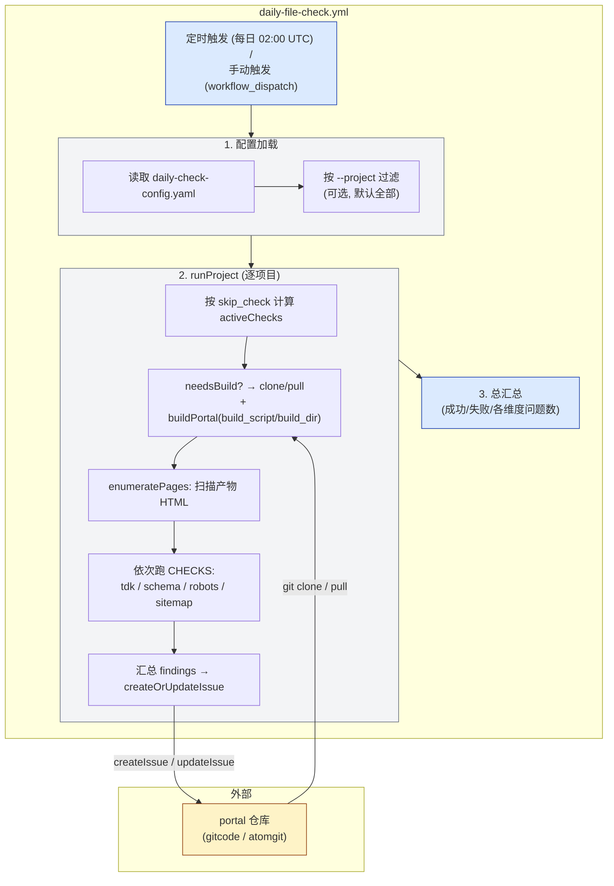

# Daily File Check Workflow Design 文档

## 概述

Daily File Check 是一个**配置驱动**的定时巡检流程，用于检查前端 portal 项目页面的 SEO/GEO 配置完整性。当前已实现 TDK（title/description/keywords）与 JSON-LD Schema 两类检查，并预留 robots.txt、sitemap 覆盖等可插拔检查项。

所有待检项目（仓库地址、构建命令、产物目录、SEO 配置目录等）集中维护在仓库根的 [`daily-check-config.yaml`](../daily-check-config.yaml)，脚本逐项目运行并把缺失项汇总成 issue 提到对应仓库。

> gitcode.com 与 atomgit.com 是同一平台的两个域名，API（`api.atomgit.com`）与鉴权（`ATOMGIT_TOKEN`）通用。

## 流程图



## 配置文件 daily-check-config.yaml

每个项目一个条目，字段如下：

| 字段 | 必填 | 说明 |
|------|------|------|
| `name` | ✅ | 项目名，`--project` 按此精确匹配 |
| `owner` / `repo` | ✅ | 仓库 owner/repo，用于缓存目录与提 issue |
| `repo_url` | 构建类检查必填 | clone 地址；私有仓库会注入 `ATOMGIT_TOKEN` |
| `branch` | 可选 | 目标分支（当前用 `git pull --rebase` 跟随默认分支） |
| `framework` | 可选 | 框架标识（VitePress / Nuxt，仅作记录） |
| `build_script` | 构建类检查必填 | 构建用的 npm script（如 `build:geo` / `generate:geo`） |
| `build_dir` | 构建类检查必填 | 构建产物目录（相对仓库根，如 `app/.vitepress/dist`） |
| `seo_config_dir.tdk` | tdk 检查必填 | TDK 配置根目录（如 `.geo/tdks`） |
| `seo_config_dir.schema` | schema 检查必填 | JSON-LD 配置根目录（如 `.geo/jsonld`） |
| `skip_check` | 可选 | 跳过的检查项数组，如 `[tdk, schema]` |
| `home` | 可选 | 线上站点 URL 数组，供 robots/sitemap 检查使用 |

示例：

```yaml
projects:
  - name: openEuler
    owner: openeuler
    repo: openEuler-portal
    repo_url: https://gitcode.com/openeuler/openEuler-portal.git
    branch: master
    framework: VitePress
    build_dir: app/.vitepress/dist
    build_script: build:geo
    seo_config_dir:
      tdk: .geo/tdks
      schema: .geo/jsonld
    home:
      - https://www.openeuler.org/
```

## 核心脚本说明

### scripts/geo-daily-check/check-single.js

唯一入口脚本，配置驱动逐项目运行。

**命令行参数**:

| 参数 | 说明 | 默认 |
|------|------|------|
| `--config=<path>` | 配置文件路径 | 仓库根 `daily-check-config.yaml` |
| `--project=<name>` | 只跑指定 `name` 的项目 | 全部项目 |
| `--dryRun` | 仅检查、打印汇总，不提 issue | false |

**关键函数**:

| 函数 | 用途 |
|------|------|
| `loadConfig(path)` | 解析 YAML，返回 `projects` 数组 |
| `injectToken(repoUrl, token)` | 把 token 注入 https 仓库地址（公开仓库免 token） |
| `prepareProjectDir(owner, repo, repoUrl)` | clone 或 `git pull --rebase`，返回 `{ dir, skipBuild }` |
| `enumeratePages(buildDir)` | 扫描产物 HTML，归一化出 `{ key, url }` 页面列表 |
| `hasConfig(workDir, seoDir, key)` | 判断 `{seoDir}/{key}/index.json` 是否存在 |
| `runProject(project, { dryRun })` | 单项目主流程：构建 → 跑检查 → 提 issue |
| `createOrUpdateIssue(project, findings)` | 按 `[GEO配置缺失]` 前缀查找并创建/更新 issue |

**页面路径约定**（`enumeratePages`）：产物 HTML 归一化为配置定位用的 `key` 与展示用的 `url`：

| 产物文件 | key（定位配置） | url（展示） |
|----------|----------------|-------------|
| `index.html` | `index` | `/` |
| `about/index.html` | `about` | `/about` |
| `en/docs/index.html` | `en/docs` | `/en/docs` |

SEO 配置文件即查 `{workDir}/{seo_config_dir.*}/{key}/index.json` 是否存在。

**扫描忽略规则**（`HTML_IGNORE`）：`200/404/error.html`、`baidu_verify`、`blog(s)/news/showcase(s)` 目录。

### scripts/lib/portal-build.js

`buildPortal(workDir, opts)` 负责安装依赖并构建。本流程新增两个可选覆盖项：

- `opts.buildScript` —— 传入则直接用（来自 `build_script`），否则按候选列表自动探测
- `opts.outputDirRel` —— 传入则直接用并校验存在（来自 `build_dir`），否则按 mtime 在候选目录里挑最新

未传时保持原自动探测行为，向后兼容其它调用方。

## 可插拔检查项

检查项集中注册在 `CHECKS`，每项形如 `{ needsBuild, dimension, run }`：

```js
const CHECKS = {
  tdk:     { needsBuild: true,  dimension: 'tdk',     run: checkTDK },
  schema:  { needsBuild: true,  dimension: 'schema',  run: checkSchema },
  robots:  { needsBuild: false, dimension: 'robots',  run: checkRobots },   // 占位
  sitemap: { needsBuild: true,  dimension: 'sitemap', run: checkSitemap },
};
```

- `run(ctx)` 返回 `{ findings: [{ url, message }], skipped?, todo? }`
- `ctx = { project, workDir, buildDir, pages, log }`
- `needsBuild` 决定该项目是否需要 clone + 构建；不依赖产物的项目（如纯 robots）不会克隆
- `skip_check` 里列出的 key 会从 `activeChecks` 中剔除

| 检查项 | 状态 | 逻辑 |
|--------|------|------|
| `checkTDK` | ✅ 已实现 | 遍历页面，缺 `{seo_config_dir.tdk}/{key}/index.json` 即记一条 finding |
| `checkSchema` | ✅ 已实现 | 遍历页面，缺 `{seo_config_dir.schema}/{key}/index.json` 即记一条 finding |
| `checkRobots` | 🚧 占位 | 后续用 `lib/html-fetch.js` 拉取 `project.home` 的 robots.txt 校验合理性 |
| `checkSitemap` | ✅ 已实现 | 从 robots.txt 发现 sitemap（回退 `/sitemap.xml`），拉取并展开 `<sitemapindex>`，与产物页面**按 pathname** 比对，列出未收录路径 |

**checkSitemap 细节**（`needsBuild: true`，需遍历产物页面）：

1. `discoverSitemaps(home)` —— 拉 `{home}/robots.txt`，正则提取 `Sitemap:` 行；解析不到则回退 `{home}/sitemap.xml`
2. 复用 [`getSitemapUrls`](../scripts/checks/sitemap-inclusion.js)（已导出）拉取并递归展开 sitemap index，带缓存
3. `normalizePathname` —— URL 解码、去尾斜杠、去 `.html`，**只比 pathname 忽略 host**（`project.home` 可能含双等价域名，sitemap 仅产一份）
4. 产物页面 `page.url` 归一化后不在收录集合 → 记一条 `页面未被 sitemap 收录` finding
5. sitemap 全部拉取失败 / 为空 → `skipped`，不误报

> 新增检查项：实现 `checkXxx(ctx)` 函数并在 `CHECKS` 注册即可；若依赖线上站点设 `needsBuild: false`，若依赖构建产物设 `needsBuild: true`。

## Issue 上报

复用 [`scripts/lib/atomgit-api.js`](../scripts/lib/atomgit-api.js)。所有 findings 汇总成一个 issue：

- **标题**: `[GEO配置缺失] {owner}/{repo}: {N} 项检查未通过`
- **去重**: 按 `[GEO配置缺失]` 前缀查找已有 issue，存在则 `updateIssue` 否则 `createIssue`
- **正文**: 按维度列表

```markdown
**项目**: openeuler/openEuler-portal

检测到以下页面/检查项存在问题:

| Dimension | 页面路径 | 问题描述 |
| --- | --- | --- |
| tdk | /about | 缺少 TDK (title, description, keywords) 配置 |
| schema | / | 缺少 JSON-LD 结构化数据配置 |
```

无 finding 或未设 `ATOMGIT_TOKEN`（或 `--dryRun`）时不提 issue。

## Workflow 配置

### .github/workflows/daily-file-check.yml

**触发方式**:
- 定时: 每日 02:00 UTC (`'0 2 * * *'`)
- 手动: workflow_dispatch

**参数**:
| 参数 | 说明 | 默认 |
|------|------|------|
| `project` | 只检查指定项目（配置里的 `name`，留空全部） | 空 |
| `dry_run` | 仅检查不提 issue | false |

**环境变量**:
- `ATOMGIT_TOKEN`: 提 issue 认证；克隆私有仓库时注入 `repo_url`

**运行命令**（runner: `portal-x86`）:
```bash
node scripts/geo-daily-check/check-single.js [--dryRun] [--project=<name>]
```

## 缓存与构建

- 仓库缓存目录: `{os.tmpdir()}/.cache/geo-bot/projects/{owner}-{repo}`
- 已存在且是 git 仓库 → `git pull --rebase`；`Already up to date.` 且产物目录已存在 → 跳过构建复用产物
- 更新失败或目录损坏 → 删除重新 `git clone --depth=100`

## 错误处理

- 单个项目失败（克隆/构建/检查异常）不阻断其它项目，记入汇总
- 单个检查项异常被 try/catch 包住，不影响其它检查项
- 末尾打印总汇总（项目数 / 成功 / 失败 / 各维度问题数）；有失败项目时进程 `exit 1`

## 本地调试

```bash
# 全部项目, 仅检查不提 issue
node scripts/geo-daily-check/check-single.js --dryRun

# 只跑单个项目
node scripts/geo-daily-check/check-single.js --project=openEuler --dryRun

# 用自定义配置
node scripts/geo-daily-check/check-single.js --config=/path/to/cfg.yaml --dryRun
```

> Windows 本地完整 checkout openEuler-portal 可能因 260 字符路径限制失败，属系统限制；Linux runner 不受影响。

## 版本历史

| 版本 | 日期 | 变更 |
|------|------|------|
| 2.1.0 | 2026-06-02 | 实现 checkSitemap：robots.txt 发现 sitemap → 展开 index → 按 pathname 比对产物页面收录覆盖；复用并导出 checks/sitemap-inclusion.js 的 getSitemapUrls |
| 2.0.0 | 2026-06-02 | 重构为配置驱动多项目（daily-check-config.yaml）+ 可插拔检查项（checkTDK/checkSchema + robots/sitemap 占位）；修复 TDK/Schema 标志位写反 bug；portal-build 支持显式 build_script/build_dir；删除 check-batch.js，workflow 改单次运行 |
| 1.0.0 | 2026-05 | 原版本：单 `--repo` 参数、硬编码候选目录猜测、check-batch.js 批量编排 |
