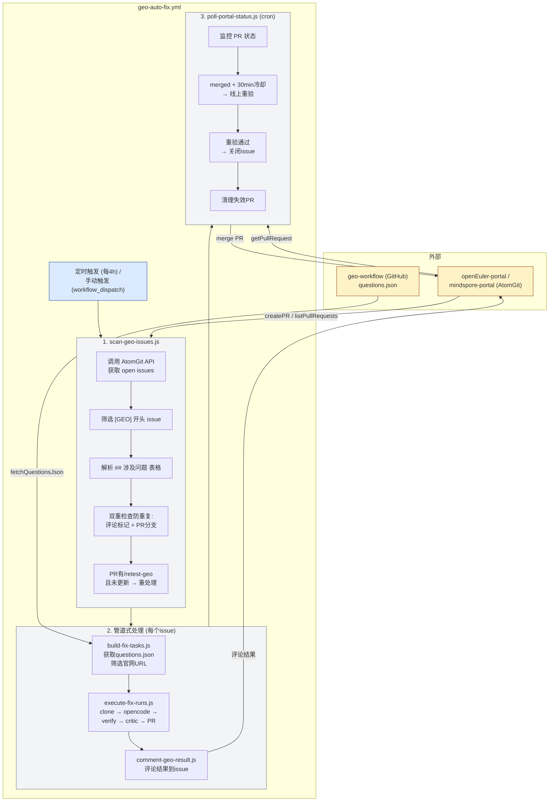

# GEO Auto Fix Workflow 文档

## 概述

GEO Auto Fix Workflow 是一个自动化流程，用于扫描 AtomGit portal 仓库的 `[GEO]` 开头的 issue，自动执行 SEO/GEO 可发现性修复。

## 流程图



## 核心脚本说明

### 1. scan-geo-issues.js

**用途**: 扫描 AtomGit portal 仓库的 `[GEO]` issue

**输入**:
- `--owner=xxx` / `--repo=xxx` 或 `--repo-url=owner/repo`
- `--community=xxx` (可选，覆盖自动推断)

**输出** (stdout JSON):
```json
{
  "run_at": "2024-01-01T00:00:00Z",
  "portal": { "owner": "openeuler", "repo": "openEuler-portal" },
  "community": "openEuler",
  "issues": [
    {
      "number": 123,
      "title": "[GEO] xxx问题",
      "url": "https://atomgit.com/...",
      "body": "原始body",
      "problem_ids": ["q_074", "q_123"]
    }
  ],
  "skipped": [
    { "number": 124, "reason": "已有处理标记" }
  ]
}
```

**表格解析逻辑**:
```javascript
// 匹配 ## 涉及问题 后的表格，提取第一列问题ID
function parseProblemIdsFromBody(body) {
  const match = body.match(/## 涉及问题\s*\n\|.+\|\s*\n\|.+\|\s*\n((?:\|.+\|\s*\n?)+)/);
  // 提取第一列 (q_xxx 格式)
  return rows.map(r => r.split('|')[1]?.trim()).filter(id => id?.startsWith('q_'));
}
```

**PR审批状态检查**:
```javascript
// 检查是否存在 PR 及是否有 /retest-geo 评论，并比较时间判断是否需要重新处理
async function checkPrRetestRequest(owner, repo, community, issueNumber) {
  const branchName = `geo/fix-${community.toLowerCase()}-${issueNumber}`;
  const prs = await listPullRequests({ owner, repo, head: branchName, state: 'open' });
  if (!prs.length) return { hasPr: false };
  
  // 获取PR详情，得到updated_at
  const prDetail = await getPullRequest({ owner, repo, number: prs[0].number });
  const prUpdatedAt = new Date(prDetail.updated_at).getTime();
  
  // 获取评论列表，找/retest-geo评论
  const comments = await listPullRequestComments({ owner, repo, pull_number: prs[0].number });
  const retestComments = comments.filter(c => (c.body || '').includes('/retest-geo'));
  if (!retestComments.length) return { hasPr: true, needsRetest: false };
  
  // 按 created_at 排序，取最后一个
  const sorted = retestComments.map(c => ({ id: c.id, created_at: c.created_at }))
    .sort((a, b) => new Date(a.created_at) - new Date(b.created_at));
  const lastComment = sorted[sorted.length - 1];
  
  // 获取评论详情，得到created_at
  const commentDetail = await getPullRequestComment({ owner, repo, comment_id: lastComment.id });
  const commentCreatedAt = new Date(commentDetail.created_at).getTime();
  
  // 比较时间：PR已更新则跳过，PR未更新则继续处理
  if (prUpdatedAt > commentCreatedAt) {
    return { hasPr: true, needsRetest: false, skipBecausePrUpdated: true };
  } else {
    return { hasPr: true, needsRetest: true };
  }
}
```

**跳过逻辑**:
- 无问题ID → 跳过
- 已有处理标记评论 → 跳过
- PR存在且无 `/retest-geo` 评论 → 跳过
- PR存在且有 `/retest-geo` 评论，但 PR 已更新（`updated_at` > 评论 `created_at`）→ 跳过
- PR存在且有 `/retest-geo` 评论，且 PR 未更新（`updated_at` <= 评论 `created_at`）→ 继续处理（重新修复）

### 2. build-fix-tasks.js

**用途**: 根据问题ID获取questions.json数据，构建修复任务

**输入**: stdin JSON 或 `--input=file.json`

**处理流程**:
1. 调用 `fetchQuestionsJson(community)` 从 GitHub geo-workflow 仓库获取数据
2. 按 `problem_ids` 过滤匹配的 questions
3. 遍历每个匹配的问题：
   - 筛选 `official_urls`，只保留 hostname 属于当前 community 官网域的 URL
   - 若某问题的所有 URL 都不属于官网域，跳过该问题
4. 若所有问题都不涉及官网域，输出 `skip: true`，skip_reason: `'未涉及官网页面'`
5. 构建修复任务 payload

**输出** (stdout JSON):
```json
{
  "run_at": "...",
  "portal": { "owner": "...", "repo": "...", "base_branch": "master" },
  "community": "openEuler",
  "issue": { "number": 123, "url": "...", "title": "[GEO] ..." },
  "urls": [
    { "url": "https://www.openeuler.org/zh/...", "question_id": "q_074", "question_text": "..." }
  ],
  "problems": [
    { "url": "...", "dimension": "all", "description": "..." }
  ]
}
```

### 3. execute-fix-runs.js

**用途**: 执行 opencode agent 修复，创建 PR

**输入**: stdin JSON 或 `--input=file.json`

**处理流程**:
1. 克隆 portal 仓库到缓存目录
2. 执行 baseline build
3. 调用 opencode agent 执行修复
4. 执行 post-agent build
5. 运行 verify 检查修复效果
6. 运行 critic 反向审查
7. git commit + push + 创建 PR

**输出** (stdout JSON):
```json
{
  "run_at": "...",
  "issue_number": 123,
  "issue_url": "...",
  "community": "openEuler",
  "portal": { "owner": "...", "repo": "..."},
  "status": "pr_created",
  "pr_url": "https://atomgit.com/...",
  "pr_number": 45,
  "branch": "geo/fix-openEuler-123",
  "verify": { "summary": { "fixed": 2, "still_failing": 0 } },
  "critic": { "verdict": "pass", "reason": "..." }
}
```

### 4. comment-geo-result.js

**用途**: 将修复结果评论到 AtomGit issue

**输入**: stdin JSON 或 `--input=file.json`

**命令行参数**: `--owner=xxx` / `--repo=xxx`

**输出**: 评论已添加的确认信息

**评论格式**:
```markdown
## 🤖 GEO 自动修复结果

| 项 | 值 |
| --- | --- |
| 状态 | ✅ PR已创建 |
| PR | #45 |
| 分支 | geo/fix-openEuler-123 |

> 关联issue: [#123](...)

### Verify 结果
✅ 已修复 2 / ❌ 未修复 0

<!-- geo-processed v1 -->
```

### 5. poll-portal-status.js

**用途**: 监控 PR 状态，重验并关闭已解决的 issue

**处理流程**:
1. 扫描本仓的 `[GEO]` tracker issues
2. 检查关联的 AtomGit PR 状态
3. PR merged + 30min 冷却后调用 `analyzeUrl` 重验
4. 重验通过 → 评论 + 关闭 issue
5. 清理失效 PR (对应 issue 已不在 active 列表)

## 管道式设计

### 核心原则

1. **每个脚本支持 stdin 输入**:
   - 优先从 stdin 读取 JSON
   - fallback 到 `--input=file.json` 参数

2. **输出到 stdout**:
   - JSON 数据输出到 stdout
   - 日志输出到 stderr

3. **管道连接**:
```bash
echo "$ISSUE" | node build-fix-tasks.js | node execute-fix-runs.js | tee result.json | node comment-geo-result.js
```

4. **tee 保存关键结果**:
   - `execute-fix-runs.js` 的输出用 `tee` 同时保存和传递
   - 失败时可查看 result 文件调试

## 标记常量

定义在 `scripts/lib/geo-markers.js`:

| 标记 | 用途 |
|------|------|
| `GEO_PROCESSED_MARKER` | issue 已处理完成标记 |
| `GEO_SKIP_NO_URLS` | 跳过原因：无官网URLs |
| `GEO_SKIP_NO_PROBLEMS` | 跳过原因：无匹配问题 |
| `GEO_REVALIDATE_MARKER` | 重验结果标记 |
| `GEO_PR_STATUS_MARKER` | PR 状态通知标记 |

## Workflow 配置

### geo-auto-fix.yml

**触发方式**:
- 定时: 每4小时 (`'17 */4 * * *'`)
- 手动: workflow_dispatch (指定 owner/repo/community)

**参数**:
| 参数 | 说明 | 默认值 |
|------|------|--------|
| owner | Portal仓库owner | openeuler |
| repo | Portal仓库repo | openEuler-portal |
| community | Community名称 (可选) | 自动推断 |
| dry_run | 仅扫描不执行 | false |

**环境变量**:
- `ATOMGIT_TOKEN`: AtomGit API 认证
- `GEO_GITHUB_TOKEN`: GitHub geo-workflow 仓库访问 (获取 questions.json)
- `AGENT_FILE`: opencode agent prompt 文件路径
- `CRITIC_AGENT_FILE`: critic prompt 文件路径

## 数据来源

### questions.json

**位置**: GitHub `opensourceways/geo-workflow` 仓库

**路径**: `assessments/{community}/questions.json`

**格式**:
```json
[
  {
    "id": "q_074",
    "question": "openEuler Compass-CI 持续集成平台如何使用？",
    "official_urls": ["https://www.openeuler.org/zh/..."],
    "notes": ""
  }
]
```

**获取方式**: 调用 `scripts/lib/geo-workflow-data.js` 的 `fetchQuestionsJson(community)`

## Community 配置

定义在 `scripts/lib/community-map.js`:

| Community | Portal仓库 | 官网域 |
|-----------|------------|--------|
| openEuler | openeuler/openEuler-portal | www.openeuler.org, www.openeuler.openatom.cn |
| MindSpore | mindspore/mindspore-portal | www.mindspore.cn |

## 核心库说明

### AtomGit API (`scripts/lib/atomgit-api.js`)

提供 AtomGit API 调用封装，包含自动重试机制：

| 函数 | 用途 |
|------|------|
| `listIssues(owner, repo, state)` | 列出仓库issues |
| `listIssueComments(owner, repo, issue_number)` | 列出issue评论 |
| `findIssueByTitlePrefix(owner, repo, prefix, state)` | 按标题前缀查找issue |
| `createIssue` | 创建issue |
| `updateIssue` | 更新issue |
| `addIssueComment` | 添加评论 |
| `createPullRequest` | 创建PR |
| `updatePullRequest` | 更新PR |
| `listPullRequests` | 列出PR |
| `listPullRequestComments(owner, repo, pull_number)` | 列出PR评论 |
| `getPullRequestComment(owner, repo, comment_id)` | 获取PR评论详情 |
| `getPullRequest` | 获取PR详情 |
| `closePullRequest` | 关闭PR |
| `getRef` | 获取git引用 |

### 公共工具 (`scripts/lib/utils.js`)

提供通用工具函数供所有脚本复用：

| 函数 | 用途 |
|------|------|
| `parseArgs(argv)` | 解析命令行参数为对象 |
| `log(msg)` | 带时间戳的日志(输出到stderr) |
| `readInput(args)` | 从stdin或--input文件读取JSON输入 |

使用示例：
```javascript
import { parseArgs, log, readInput } from './lib/utils.js';

const args = parseArgs(process.argv.slice(2));
const input = await readInput(args);
log('处理开始...');
```

## 保留的组件

| 文件 | 用途 |
|------|------|
| `daily-file-check.yml` | 新页面配置检查 (独立功能) |
| `analyze-discoverability.js` | URL分析 (重验依赖) |
| `scripts/checks/*.js` | 修复验证检查 |
| `scripts/lib/atomgit-api.js` | AtomGit API调用封装 |
| `scripts/lib/geo-workflow-data.js` | questions.json获取 |
| `scripts/lib/community-map.js` | community配置映射 |
| `scripts/lib/portal-build.js` | portal构建 |
| `scripts/lib/utils.js` | 公共工具函数 |
| `scripts/lib/geo-markers.js` | 标记常量 |
| `.github/agents/geo-fix-prompt.md` | opencode agent prompt |
| `.github/agents/geo-critic-prompt.md` | critic prompt |

## 已删除的组件

| 文件 | 原用途 |
|------|--------|
| geo-poll.yml | 被geo-auto-fix.yml替代 |
| geo-develop-workflow.yml | analyze+fix流程被替代 |
| sync-geo-issues.js | 不再从GitHub同步 |
| fetch-geo-issues.js | 被scan-geo-issues.js替代 |
| run-analysis.js | URL分析流程被替代 |
| generate-report.js | 报告生成被替代 |
| open-portal-issues.js | 不再单独创建portal issue |
| fetch-fix-payload.js | 不再从GitHub评论获取payload |
| comment-fix-summary.js | 被comment-geo-result.js替代 |

## 使用示例

### 本地调试

```bash
# 1. 扫描issues
node scripts/scan-geo-issues.js --owner=openeuler --repo=openEuler-portal > issues.json

# 2. 处理单个issue
cat issues.json | jq -c '.issues[0]' > issue.json
cat issue.json | node scripts/build-fix-tasks.js > task.json

# 3. 执行修复 (dry-run)
cat task.json | node scripts/execute-fix-runs.js --dry-run

# 4. 完整流程
cat issue.json | node scripts/build-fix-tasks.js | node scripts/execute-fix-runs.js | tee result.json | node scripts/comment-geo-result.js --owner=openeuler --repo=openEuler-portal
```

### Workflow 手动触发

1. 进入 GitHub Actions 页面
2. 选择 `GEO Auto Fix` workflow
3. 点击 `Run workflow`
4. 填写参数:
   - owner: `openeuler`
   - repo: `openEuler-portal`
   - community: `openEuler` (可选)
   - dry_run: `true` (仅扫描测试)

## 防重复处理机制

### 双重检查

1. **评论标记检查**: 检查 issue 评论是否已有 `<!-- geo-processed v1 -->` 标记
2. **PR分支检查**: 检查 portal 仓库是否已有 `geo/fix-{community}-{issue_number}` 分支的 open PR
   - 若 PR 存在，进一步检查 PR 评论是否包含 `/retest-geo`
   - 有 `/retest-geo` → 继续处理（重新修复）
   - 无 `/retest-geo` → 跳过

任一条件满足则跳过该 issue（除非 PR 有 `/retest-geo` 请求重新处理）。

## 分支命名规则

PR 分支命名: `geo/fix-{community}-{issue_number}`

示例: `geo/fix-openEuler-123`

## Issue 标题格式

AtomGit portal 仓库的 issue 标题必须以 `[GEO]` 开头。

示例: `[GEO] openEuler Compass-CI 持续集成平台页面SEO优化`

## 问题表格格式

Issue body 中必须包含 `## 涉及问题` 表格:

```markdown
## 涉及问题
| 问题ID | 问题 | 引用率 | 已引用平台 |
| --- | --- | --- | --- |
| q_074 | openEuler Compass-CI... | 15% | ChatGPT, Perplexity |
| q_123 | ... | 8% | Gemini |
```

第一列 `问题ID` (q_xxx 格式) 用于匹配 questions.json 数据。

## 错误处理

- 单个 issue 处理失败不阻断其他 issue
- 管道中 `execute-fix-runs.js` 失败时，`comment-geo-result.js` 会评论失败原因
- Workflow 失败时会显示 Actions run URL

## 版本历史

| 版本 | 日期 | 变更 |
|------|------|------|
| 2.1.0 | 2026-05-21 | 新增PR `/retest-geo` 重处理机制(含时间比较)；build-fix-tasks跳过不涉及官网问题；新增AtomGit `getPullRequestComment` API |
| 2.0.0 | 2024-01 | 重构为管道式设计，适配AtomGit [GEO] issue |
| 1.0.0 | 2023-xx | 原版本 (已删除) |