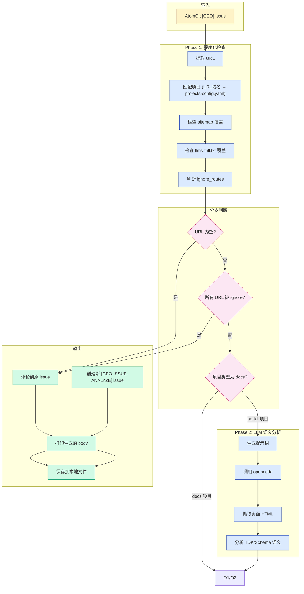
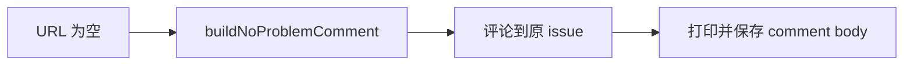
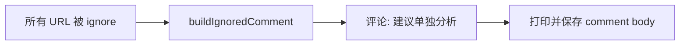
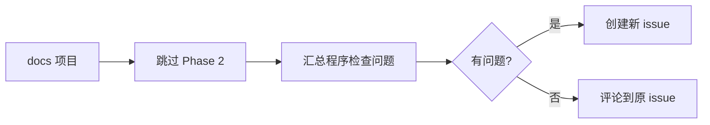
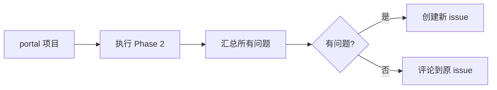

# GEO Issue Analyze Workflow 文档

## 概述

`geo-issue-analyze` 是一个自动化分析流程，用于扫描 AtomGit portal 仓库的 `[GEO]` issue 并执行 SEO/GEO 可发现性检查。采用**两阶段混合模式**：程序化检查 + LLM 语义分析。

## 流程图



## 流程详解

### 1. 输入阶段

**来源**: `scripts/geo-issue-analyze/scan-issues.js` 扫描 `[GEO]` issue

**输入格式** (JSON):
```json
{
  "owner": "openeuler",
  "repo": "openEuler-portal",
  "number": 123,
  "title": "[GEO] xxx 问题",
  "body": "issue 内容，包含 URL",
  "url": "https://atomgit.com/openeuler/openEuler-portal/issues/123",
  "cache_file": "/tmp/.cache/geo-bot/issue-analyze/exist-issues/openeuler-openEuler-portal-123.md"
}
```

### 2. Phase 1: 程序化检查

#### 2.1 URL 提取

从 issue body 中按固定格式提取 URL（匹配 `### 根本原因分析` 区块中的 `[官方页面: URL]`）：
```js
const urlPattern = /###.*?根本原因分析.*?```.*?\[官方页面:.*?(https:\/\/.+)\]/;
const urls = body.match(urlPattern)?.[1];
return [urls];
```

#### 2.2 项目匹配

根据 URL 域名匹配 `projects-config.yaml` 中的项目：
- 比较 URL hostname 与项目 `home` 字段的 hostname
- 返回匹配的项目配置（包含 `owner`、`repo`、`ignore_routes` 等）

#### 2.3 检查项

| 检查项 | 函数 | 检查内容 |
|--------|------|---------|
| **sitemap 覆盖** | `checkUrlInSitemap` | URL 是否在 sitemap.xml 中被收录 |
| **llms-full.txt 覆盖** | `checkUrlInLlmsTxt` | URL 是否在 /llms-full.txt 中被列出 |

#### 2.4 ignore_routes 处理

如果 URL pathname 匹配项目的 `ignore_routes` 配置：
- 返回 `{ covered: true, ignored: true }`
- 不计入问题，后续流程跳过

#### 2.5 docs 与 portal 项目差异

| 项目类型 | `project_type` | Phase 1 检查 | Phase 2 |
|---------|----------------|-------------|---------|
| docs | `docs` | sitemap + llms-full.txt | **跳过** |
| portal | `portal` | sitemap + llms-full.txt | 执行 |

### 3. 分支判断

#### 分支 1: URL 为空



#### 分支 2: 所有 URL 被 ignore_routes 跳过



#### 分支 3: docs 项目



#### 分支 4: portal 项目



### 4. Phase 2: LLM 语义分析

**仅对 portal 项目执行**。

#### 4.1 提示词生成

生成包含以下内容的提示词：
- 待分析 URL 列表
- 分析要求（抓取页面、提取 TDK/Schema、语义分析）
- 输出格式要求（JSON block）

#### 4.2 opencode 调用

```bash
opencode run <input-file> --model "$AI_MODEL" --dangerously-skip-permissions
```

> `AI_MODEL` 环境变量默认 `alibaba-cn/glm-5`（代码 fallback）。geo-issue-analyze.yml workflow 未注入此变量，使用代码默认值。

#### 4.3 LLM 分析内容

1. **抓取页面 HTML**
2. **提取信息**:
   - `<title>`、`<meta name="description">`、`<meta name="keywords">`
   - `<script type="application/ld+json">` JSON-LD 内容
3. **语义分析**:
   - TDK/Schema 内容是否与页面实际内容一致
   - 是否包含不存在于页面中的信息（如其他社区名称）
   - description 长度是否合理
   - JSON-LD schema 类型是否合适

#### 4.4 输出格式

LLM 输出结构化 JSON：
```json
<!-- ANALYZE_RESULT -->
{
  "has_problems": true/false,
  "source_issue_id": 123,
  "target_owner": "openeuler",
  "target_repo": "openEuler-portal",
  "analyzed_urls": ["https://..."],
  "problems": [
    { "url": "...", "dimension": "tdk-quality", "description": "问题描述" }
  ],
  "message": "无问题时的总结"
}
```

### 5. 输出阶段

#### 5.1 问题汇总

```js
allProblems = [...programProblems, ...llmProblems]
```

| 问题维度 | 来源 | 说明 |
|---------|------|------|
| `sitemap` | program | URL 未被 sitemap 收录 |
| `llms.txt` | program | URL 未在 llms-full.txt 中 |
| `tdk-quality` | llm | TDK 语义质量问题 |
| `schema-quality` | llm | Schema 语义质量问题 |

#### 5.2 处理方式

| 场景 | 操作 | Body 类型 |
|------|------|----------|
| 无问题 | 评论到原 issue | `buildNoProblemComment` → comment |
| 有问题 | 1. 创建新 `[GEO-ISSUE-ANALYZE]` issue | `buildProblemIssueBody` → issue |
| 有问题 | 2. 回评原 issue（告知结论+新issue链接） | `buildHasProblemsComment` → comment |

#### 5.3 回评原 issue

当发现问题并创建新 issue 后，会回评原 issue，内容包括：
- 问题总数和分布
- 涉及的页面列表
- 新 issue 的链接

示例：
```markdown
## GEO 分析结果

经分析，此 issue 涉及的页面存在 **5 个 GEO 配置问题**。

**问题分布**: sitemap: 2个、llms.txt: 1个、tdk-quality: 2个

**涉及页面**:
- https://www.openeuler.org/zh/download/

**处理结果**: 已在目标仓库创建 issue 进行跟踪

🔗 新 issue: [#456](https://atomgit.com/openeuler/openEuler-portal/issues/456)

<!-- geo-analyze-result -->
```

#### 5.4 打印与保存

```js
saveAndPrintGeneratedBody(issue, generatedBody, type)
```

- **打印到控制台**: 生成的 comment/issue body
- **保存到本地**: `CACHE_DIR/generated-bodies/{owner}-{repo}-{number}-{type}.md`

| type | 说明 |
|------|------|
| `comment` | 评论内容 |
| `issue` | 新 issue 内容 |
| `error` | 错误报告 |

## 关键文件

| 文件 | 用途 |
|------|------|
| `scripts/geo-issue-analyze/scan-issues.js` | 扫描 [GEO] issues |
| `scripts/geo-issue-analyze/process-single.js` | 单 issue 分析入口 |
| `scripts/geo-issue-analyze/url-checks.js` | URL 检查模块 (sitemap/llms-full.txt) |
| `scripts/lib/atomgit-api.js` | AtomGit API 封装 |
| `projects-config.yaml` | 项目配置（域名、ignore_routes 等） |

## 配置说明

### projects-config.yaml

```yaml
projects:
  - name: openEuler
    owner: openeuler
    repo: openEuler-portal
    project_type: portal          # portal 或 docs
    home:
      - https://www.openeuler.org/
    ignore_routes:
      - /(zh|en)/(blog|news|...)   # 跳过检查的路径 pattern
```

### 项目类型差异

| 配置项 | portal 项目 | docs 项目 |
|--------|------------|----------|
| `project_type` | `portal` | `docs` |
| Phase 1 | sitemap + llms-full.txt | sitemap + llms-full.txt |
| Phase 2 | **执行** LLM 语义分析 | **跳过** |
| 问题维度 | sitemap + llms.txt + tdk-quality + schema-quality | sitemap + llms.txt |

## 运行示例

```bash
# 本地调试 (dryRun)
node scripts/geo-issue-analyze/process-single.js --dryRun --input=issue.json

# Workflow 调用
node scripts/geo-issue-analyze/scan-issues.js --project=openEuler > issues.json
jq -c '.issues[]' issues.json | while read ISSUE; do
  node scripts/geo-issue-analyze/process-single.js --input="$ISSUE"
done
```

## 输出示例

### 控制台输出

```
=== Generated comment for Issue #999 (openeuler/openEuler-portal) ===
Source: https://atomgit.com/xxx/issues/999

## GEO 分析结果

经分析，此 issue **不涉及GEO基础配置问题**...

<!-- geo-analyze-skip -->

{
  "issue": "openeuler/openEuler-portal #999",
  "status": "commented",
  "problems": 0,
  "urls": 1
}
```

### 保存文件

```
CACHE_DIR/generated-bodies/
  openeuler-openEuler-portal-999-comment.md   # 评论内容
  openeuler-openEuler-portal-888-issue.md     # 新 issue 内容
  openeuler-openEuler-portal-777-error.md     # 错误报告
```

## 版本历史

| 版本 | 日期 | 变更 |
|------|------|------|
| 3.0.0 | 2026-06-15 | 两阶段混合模式：程序检查 + LLM 语义分析；移除 TDK/Schema 配置文件存在性检查；LLM 直接抓取页面分析 |
| 2.0.0 | 2026-06-15 | 增加 docs/portal 项目差异处理；ignore_routes 跳过逻辑 |
| 1.0.0 | 2026-06 | 初版：纯 LLM 分析模式 |